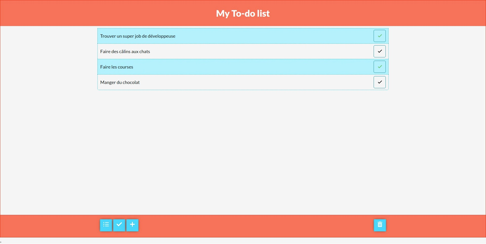
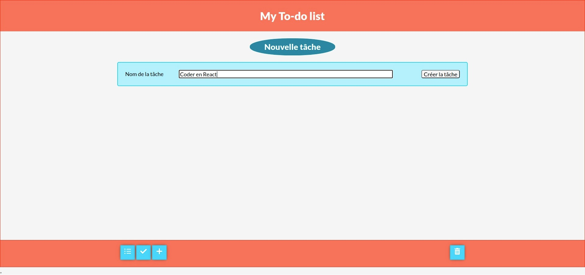

# React To-do list

Hi, I just finished training in React JS and this to-do list allows me to start having fun with React.

It also allows me to improve my mastery of all the concepts seen in the awesome training ['CSS for JavaScript developers'](https://css-for-js.dev/) of Josh Comeau.

----------------------------------------------------------------------------------------------------------------------------

Je viens de finir une formation à React JS et cette to-do list me permet de commencer à m'amuser avec React.

Elle me permet également d'améliorer ma maîtrise de certaines notions vues dans la formation géniale ['CSS for JavaScript developers'](https://css-for-js.dev/) de Josh Comeau.

📫 Vous pouvez me joindre au **06 50 70 60 08** ou par mail : **sylvie.canongia.dev@gmail.com**.

Retrouvez-moi sur [![LinkedIn][1.1]][1] ou sur [![Twitter][2.2]][2].

<!-- Icons -->

[1.1]: https://github.com/SylvieCanongia/SylvieCanongia/blob/main/images/linkedin.png (LinkedIn icon)
[2.2]: https://github.com/SylvieCanongia/SylvieCanongia/blob/main/images/twitter.png (twitter icon)

<!-- Links to your social media accounts -->

[1]: https://www.linkedin.com/in/sylvie-canongia/
[2]: https://twitter.com/CanongiaS

A bientôt !

## Compétences

## Rendu final

